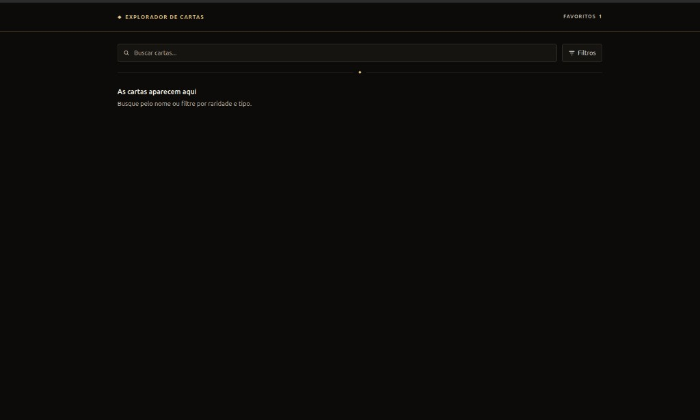
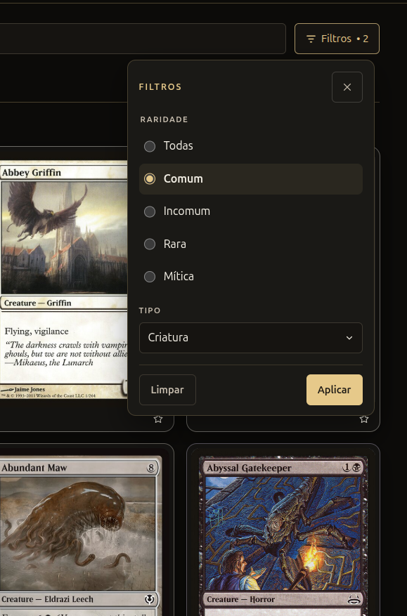
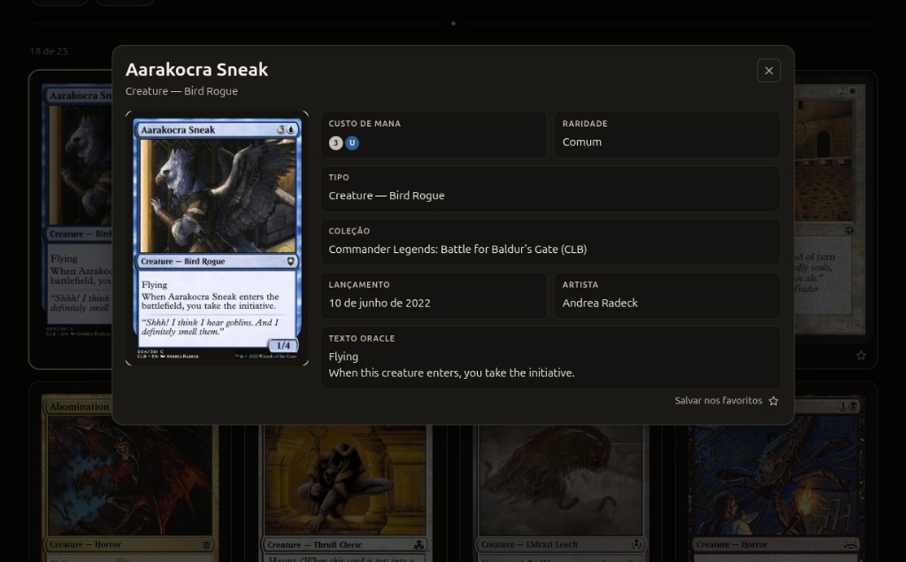
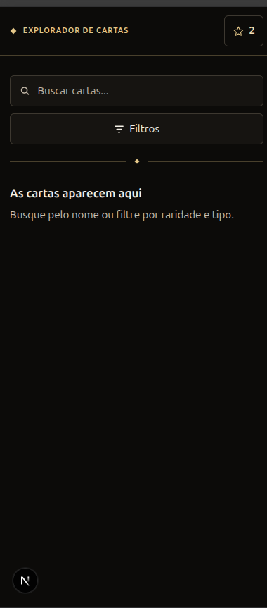
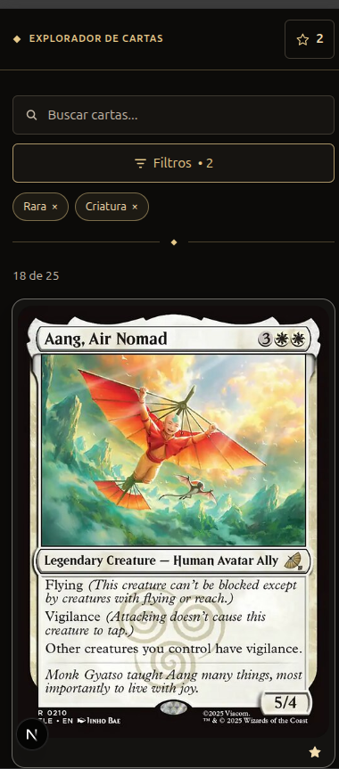
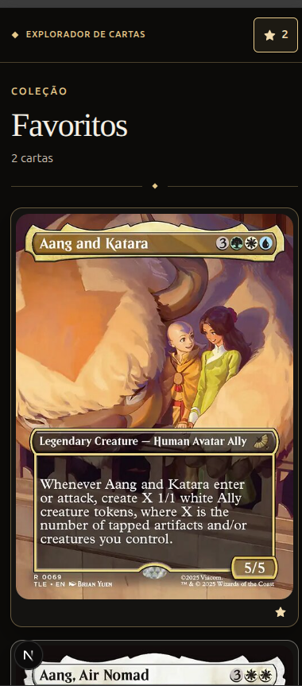

# Card Explorer

Explorador de cartas de Magic: The Gathering. A aplicação consulta a API pública do [Scryfall](https://scryfall.com/docs/api), normaliza a resposta e apresenta o resultado em uma grade com detalhe, filtros e favoritos.

[https://desafio-simbiox.vercel.app](https://desafio-simbiox.vercel.app)

| Busca | Filtros | Detalhe |
| --- | --- | --- |
|  |  |  |

| Busca no celular | Resultados | Favoritos |
| --- | --- | --- |
|  |  |  |

## Funcionalidades

- Busca por nome, com espera de 300 ms entre a digitação e a consulta.
- Filtro por raridade (comum, incomum, rara, mítica) e por tipo (criatura, artefato, encantamento, feitiço, mágica instantânea, planeswalker, terreno).
- Combinação de nome, raridade e tipo na mesma consulta.
- Estado aplicado na URL (`q`, `rarity`, `type`), restaurado ao abrir o endereço.
- Diálogo com ilustração, custo de mana, raridade, tipo, coleção, data de lançamento, artista e texto oracle.
- Favoritos persistidos neste navegador, com contagem no cabeçalho e na página `/favoritos`.
- Estados de espera, lista vazia e falha de consulta, com nova tentativa.

## Tecnologias

### Aplicação
- Next.js
- React
- TypeScript
- TanStack Query
- CSS Modules

### Qualidade
- Vitest
- Testing Library
- Playwright
- ESLint
- Prettier

### Infraestrutura
- Docker
- GitHub Actions

## Arquitetura

| Camada                  | Responsabilidade                                                                                     |
| ----------------------- | ---------------------------------------------------------------------------------------------------- |
| `src/app`               | Rotas, metadata e composição das páginas. A home é dinâmica e envolve a busca no cache de consultas. |
| `src/components`        | Interface: busca, filtros, grade, carta, diálogo, favoritos, estados vazio e de erro.                |
| `src/services/scryfall` | URL da consulta, `fetch`, timeout, classificação de erro e normalização para `Card`.                 |
| `src/hooks`             | Debounce, consulta infinita condicionada e leitura dos favoritos.                                    |
| `src/lib`               | URL da busca, cliente do TanStack Query, leitura e gravação dos favoritos.                           |
| `src/types`             | Modelo da carta e os valores aceitos de raridade e tipo.                                             |
| `src/utils`             | Data de lançamento em português.                                                                     |

## Fluxo de dados

```text
campo de busca e painel de filtros
        ↓
texto local (debounce) e filtros aplicados na URL
        ↓
useCards — TanStack Query
        ↓
searchCards — GET api.scryfall.com/cards/search
        ↓
normalização para Card
        ↓
grade, diálogo e favoritos
```

Sem nome e sem filtro, a consulta nem é habilitada. Um 404 do Scryfall volta como página vazia. Falha de rede, busca recusada (400), serviço indisponível e payload inesperado viram `CardSearchError`.

Favoritos não passam por essa consulta. O snapshot da carta é gravado em `localStorage` na chave `card-explorer.favorites`.

## Busca e filtros

Parâmetros vazios não entram na URL. Valor desconhecido de `rarity` ou `type` é ignorado. “Todas” e “Todos” também não geram parâmetro.

```text
/?q=aarakocra&rarity=common&type=creature
```

Essa URL produz a consulta `aarakocra rarity:common type:creature`, pedida assim:

```text
GET https://api.scryfall.com/cards/search
    ?q=aarakocra+rarity:common+type:creature
    &page=1
    &unique=cards
    &order=name
```

`unique=cards` agrupa impressões do mesmo nome. A ordem é o nome. O `fetch` envia `Accept: application/json`, usa o `AbortSignal` da consulta e cancela aos 8 segundos. A página não define `User-Agent`.

Cartas de duas faces usam a primeira face para tipo, mana, artista e ilustração. Se o texto oracle não vier no topo, as faces são unidas.

## UX e responsividade

Antes de qualquer filtro, a página mostra “As cartas aparecem aqui”, com a orientação de buscar pelo nome ou filtrar por raridade e tipo. Não há consulta nessa espera.

O painel abre a partir do botão **Filtros**. No desktop é um popover ancorado ao botão. Até 719 px, `matchMedia` troca o painel por uma folha inferior, com fundo escurecido. **Limpar** fica desabilitado quando o rascunho está vazio.

A primeira carga da busca usa seis skeletons na mesma grade da carta, com a proporção 488×680. Lista vazia e favoritos vazios usam um painel com título, texto e, nos favoritos, o link “Voltar para explorar”. Falha de consulta oferece **Tentar novamente**:

| Situação                                   | Mensagem                            |
| ------------------------------------------ | ----------------------------------- |
| Rede ou tempo esgotado                     | Sem conexão com o Scryfall          |
| Resposta 400                               | Não foi possível fazer essa busca   |
| Serviço indisponível ou payload inesperado | Não foi possível carregar as cartas |

O diálogo lista os campos presentes na carta. Custo de mana, coleção, data, artista e texto oracle só aparecem quando existem. A data `YYYY-MM-DD` é formatada em português. Se a ilustração falha, o nome ocupa o lugar da imagem.

No cabeçalho, a marca volta para a busca. Em telas largas, **Favoritos** é um link com a contagem ao lado. Até 719 px, o rótulo sai da visão e o controle mostra a estrela com o número. Abaixo de 420 px, a marca reduz o tamanho e o espaçamento entre as letras. A partir de 768 px, o diálogo coloca a ilustração ao lado dos dados.

A coleção lista a carta mais recente primeiro. Remover a carta aberta nessa página fecha o diálogo. A contagem usa “1 carta” ou “N cartas”.

## Acessibilidade

`html` está em `lang="pt-BR"`. O primeiro elemento focável é o link “Ir para o conteúdo”, que aponta para `#conteudo`.

O campo de busca tem rótulo associado e o formulário é `role="search"`. A raridade é um `fieldset`. O tipo é um listbox dentro do diálogo: seta para cima e para baixo movem as opções, sem ultrapassar as extremidades, e Escape fecha só a lista.

Os dois diálogos usam `role="dialog"`, `aria-modal` e nome acessível. Ao abrir, o foco entra no diálogo, o restante da página fica `inert` e o `body` deixa de rolar. Tab e Shift+Tab circulam pelos controles, inclusive quando o foco ainda está no próprio diálogo. Escape fecha e devolve o foco a quem abriu. O botão **Fechar** participa dessa ordem; o fundo que dispensa o painel não.

Cada carta é um `article` com título e linha de tipo. O botão que abre o detalhe usa esses textos no nome, `aria-haspopup="dialog"` e `aria-expanded`. O foco visível desenha o contorno dourado no cartão. A estrela da grade se chama “Salvar {nome} nos favoritos” ou “Remover {nome} dos favoritos” e expõe `aria-pressed`. No diálogo, o mesmo controle tem o texto visível “Salvar nos favoritos” ou “Remover dos favoritos”.

A ilustração tem texto alternativo. O custo de mana tem um nome único; os símbolos visuais ficam ocultos para leitor de tela. A contagem do cabeçalho entra no nome do link (“Favoritos, 2 cartas”) e o número visível não é lido de novo. Carregamento, lista vazia e a contagem “18 de 25” são `role="status"`. O erro é `role="alert"`. O skeleton é `aria-hidden`.

O foco visível global é um contorno de 2 px. Os pares de texto da paleta ficam acima de 4.5:1 — por exemplo, `#f4f0e6` sobre `#0c0b09` e `#c9bfb0` sobre o mesmo fundo. `prefers-reduced-motion: reduce` zera a transição global. Hover do cartão, pulso do skeleton e a entrada dos diálogos só animam quando o sistema permite movimento.

## Performance

A home é `force-dynamic`: o explorador é pré-renderizado com a query string, e o fallback do `Suspense` fica restrito à espera dessa leitura. O cliente do TanStack Query é criado no estado do provider da home, não num singleton de módulo, para um pedido não reaproveitar o cache de outro. `/favoritos` não importa essa biblioteca.

O diálogo entra por `next/dynamic` na grade de resultados e na coleção, só quando há uma carta selecionada. `Card` é memoizado. A primeira ilustração da grade usa `priority`; as demais, não. O diálogo também prioriza a sua imagem.

`next/image` recebe 488×680 e `sizes` conforme a largura. O otimizador está desligado em `next.config.ts`: o Scryfall responde 400 ao user-agent desse fetch, então o arquivo sai de `cards.scryfall.io`. O layout faz preconnect com `api.scryfall.com` (`crossorigin`) e com `cards.scryfall.io`.

O cache da consulta usa `staleTime` de 5 minutos, `gcTime` de 30 minutos, uma nova tentativa e `refetchOnWindowFocus: false`. A digitação não dispara uma requisição por tecla. Confirmar o filtro dispara uma. A tela não pede a segunda página do Scryfall.

As fontes são pilhas do sistema (`Segoe UI` / `system-ui` e uma serifada para o título dos favoritos), sem download de webfont. O estilo é CSS Modules. O skeleton reserva a mesma proporção da ilustração.

## Testes

`npm test` roda 51 testes em Vitest (jsdom, Testing Library). `npm run test:coverage` gera cobertura com `@vitest/coverage-v8`; o repositório não publica um percentual. O Playwright não entra nessa suíte.

A suíte cobre a montagem da query, o cliente HTTP (página vazia no 404, payload inválido, falha de rede e busca vazia sem `fetch`), a URL, o debounce, o cache, a grade, o diálogo, o foco, os filtros, os favoritos e as duas páginas.

`npm run test:e2e` gera o build de produção e executa um fluxo no Chrome já instalado na máquina (`channel: "chrome"`), na porta 4173, com um worker. API e imagens do Scryfall são interceptadas. O fluxo busca uma carta, abre o detalhe, salva nos favoritos, abre `/favoritos`, confere “1 carta” e recarrega a página.

## Docker

A imagem existe para subir o build de produção com o mesmo Node 22 do CI, sem depender da versão instalada na máquina. O resultado é o mesmo artefato em qualquer ambiente que tenha Docker.

A base é `node:22-alpine`, em duas etapas. A primeira instala dependências com `npm ci` e roda `npm run build`. A segunda copia só `.next/standalone` e `.next/static`, gerados por `output: "standalone"`. Compilador e dependências de desenvolvimento ficam fora da imagem que executa.

O processo usa o usuário `nextjs` (uid 1001, grupo `nodejs`). `PORT=3000`, `HOSTNAME=0.0.0.0` e a telemetria do Next fica desligada. O Compose publica `3000:3000`.

```bash
docker compose up --build
```

## CI

O workflow `.github/workflows/ci.yml` roda em todo `push` e `pull_request`. Permissão só de leitura do repositório. Uma execução nova cancela a anterior do mesmo ref.

O job `verify` usa `ubuntu-latest` e, depois de `npm ci`:

1. `npm run lint`
2. `npm run typecheck`
3. `npm test`
4. `npm run build`

## Como executar

Node.js 22, a mesma versão do CI e da imagem.

### Instalação

```bash
npm install
```

### Desenvolvimento

```bash
npm run dev
```

[http://localhost:3000](http://localhost:3000)

### Testes

```bash
npm test
npm run test:e2e
```

### Lint, tipos e formatação

```bash
npm run lint
npm run typecheck
npm run format:check
```

### Build

```bash
npm run build
npm start
```

### Docker

```bash
docker compose up --build
```

[http://localhost:3000](http://localhost:3000)

## Decisões técnicas

### URL como busca aplicada

O nome confirmado e os filtros vivem em `q`, `rarity` e `type`. Atualizar ou compartilhar o endereço reabre a mesma pesquisa. O rascunho do painel não altera essa URL, então marcar uma opção não dispara consulta.

### Consulta separada da interface

`buildSearchQuery` é uma função pura. A tela só entrega texto, raridade e tipo. A suíte testa a string resultante sem renderizar a página.

### TanStack Query com cliente por montagem

Cache de 5 minutos, uma nova tentativa e sem refetch ao focar a janela. O provider guarda o cliente em estado local. Um singleton de módulo misturaria o cache entre requisições no servidor.

### Favoritos como snapshot

A coleção grava a carta inteira, valida o JSON ao ler e ignora item incompleto. Abrir `/favoritos` não consulta o Scryfall de novo. A carta mais recente fica primeiro. A mesma aba ouve um evento próprio; outra aba ouve `storage`. No servidor o snapshot é uma lista vazia, e o estado vazio só aparece depois que o cliente confirma o armazenamento, para não piscar “Nenhum favorito ainda”.

### Diálogo com foco contido

Modal e filtros usam o mesmo `useDialog`: foco inicial, ciclo de Tab, Escape, `inert` no fundo e foco devolvido. O listbox de tipo trata Escape e as setas antes do diálogo, para fechar a lista sem dispensar o painel.

### Ilustração direta do CDN

Largura, altura, `sizes` e prioridade da primeira imagem estão na interface. A recompressão do Next fica desligada porque o Scryfall recusa o user-agent do otimizador. O arquivo exibido é a versão `normal`.

### Home dinâmica e diálogo adiado

`force-dynamic` faz a busca entrar no HTML do pedido, em vez de ficar atrás do fallback enquanto a query string é lida. O JavaScript do diálogo só é pedido na abertura. A página de favoritos não carrega o TanStack Query.
